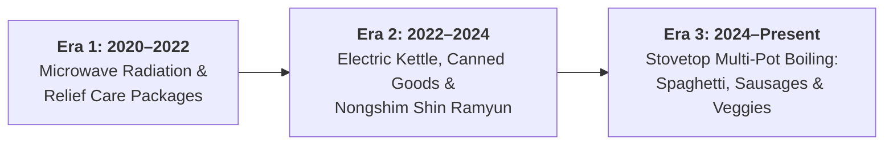

# 👨‍🍳 Nurken | The Best Chef in the East
> **A High-Performance Culinary Portfolio & Academic Web Development Showcase**

[](https://www.pace.edu/)
[](https://developer.mozilla.org/)
[](https://github.com/)
[](.)

---

## 📖 Overview

**Nurken | The Best Chef in the East** is a satirical, high-polish personal portfolio built for **Pace University’s Mobile Web Development** curriculum (Week III / Assignment III).

The website combines serious frontend engineering standards (semantic HTML5, BEM-structured Vanilla CSS, accessible controls, local theme state, dynamic JSON data hydration) with a humorous narrative chronicling the self-proclaimed "Best Chef in the East" and his three-stage evolution in domestic kitchen survival.

---

## 🎓 Academic & AI Disclosure

> [!NOTE]
> **Academic Purpose**: This project was developed strictly for educational and demonstration purposes as part of Mobile Web Development (Pace University). All culinary accolades, Michelin star claims, and dish masteries are humorous fictional storytelling.
>
> **AI Generation**: This portfolio and its visual presentation assets were generated using AI for educational demonstration purposes.

---

## ✨ Key Features & Engineering Highlights

### 🎨 1. Dynamic Theming & Multi-Accent System
- **Dark / Light Mode**: Seamless theme toggling with automatic detection of user system preferences (`prefers-color-scheme`) and persistent storage via `localStorage`.
- **5-Color Live Accent Switcher**: Instant live re-theming across customized palettes:
  - 🌶️ *Shin Chili Red* (Default)
  - 🍳 *Egg Yolk Amber*
  - 🍵 *Matcha Emerald*
  - 💎 *Cyber Cyan*
  - 🔮 *Neon Violet*

### 📱 2. Mobile-First Responsive Design
- **Fluid Layout**: Adapts gracefully across desktop displays, tablets, and ultra-narrow mobile viewports (down to 320px).
- **Responsive Header**: Dynamic brand shrinkage, subtitle hiding, and touch-optimized controls to prevent clipping or viewport overflows.
- **Responsive Multi-Column Grid**: 2-column desktop dish showcase transitioning into an ergonomic 1-column mobile view.

### ⚡ 3. Pure Vanilla Stack (Zero External Bloat)
- **100% Offline & Local**: Uses native system font stacks (`-apple-system`, `Segoe UI`, `Roboto`) without relying on external CDN font servers.
- **Robust Local Data Layer**: Asynchronously fetches from `assets/data/projects.json` with an instant, embedded JS fallback array for strict `file://` protocol compatibility.

---

## 🍽️ The 3-Stage Culinary Evolution



1. **Era 1 (2020 — 2022) | Microwave & Kinship Care Packages Genesis**
   - *Role:* Microwave Operative & Kinship Supply-Chain Dependent
   - *Focus:* 1000W electromagnetic radiation and survival on emergency home-cooked parcels shipped by relatives.
2. **Era 2 (2022 — 2024) | The Kettle & Nongshim Expansion**
   - *Role:* Senior Nongshim Ramen & Canned Goods Technician
   - *Focus:* Rapid 100°C electric kettle hydration, manual can opener deployment, and shelf-stable pantry stews.
3. **Era 3 (2024 — Present) | Stovetop Multi-Pot Boiling Mastery**
   - *Role:* Chief Boiling Officer: Sausages, Spaghetti & Veggies
   - *Focus:* Domestic culinary independence via boiling spaghetti al dente, simmering beef sausages, and flash-blanching frozen vegetable blends.

---

## 🗂️ Project Structure

```text
Assignment III/
├── index.html                  # Semantic HTML5 entry page
├── README.md                   # Project documentation & GitHub overview
└── assets/
    ├── css/
    │   ├── variables.css       # Design tokens, color palettes, spacing & theme vars
    │   ├── base.css            # CSS reset, typography, and container utilities
    │   └── style.css           # BEM component styling & responsive media queries
    ├── data/
    │   ├── projects.json       # Structured JSON dataset of prepared dishes
    │   └── descriptions.txt    # Specification notes for portfolio dishes
    ├── js/
    │   └── main.js             # Theme manager, accent picker, and dish grid renderer
    └── images/
        ├── canned-tomato-soup.jpg   # Steaming Campbell's soup bowl & can
        ├── sausages-pack.jpg        # Pan-seared 100% beef sausages & box
        ├── egg-carton-pack.jpg      # Sunny-side fried eggs & 24-egg carton flat
        └── mixed-vegetables.jpg     # Steamed rainbow vegetables & Steamfresh pouch
```

---

## 🚀 Getting Started / Running Locally

No build tools, package managers, or local server setups are required:

1. **Clone or Download** this repository.
2. Open `index.html` directly in any modern web browser:
   ```bash
   # macOS
   open index.html

   # Linux
   xdg-open index.html

   # Windows
   start index.html
   ```

---

## 📄 License & Attribution

Built for academic submission in **Mobile Web Development** (Fall 2026, Pace University). All rights reserved © 2026 Nurken.
